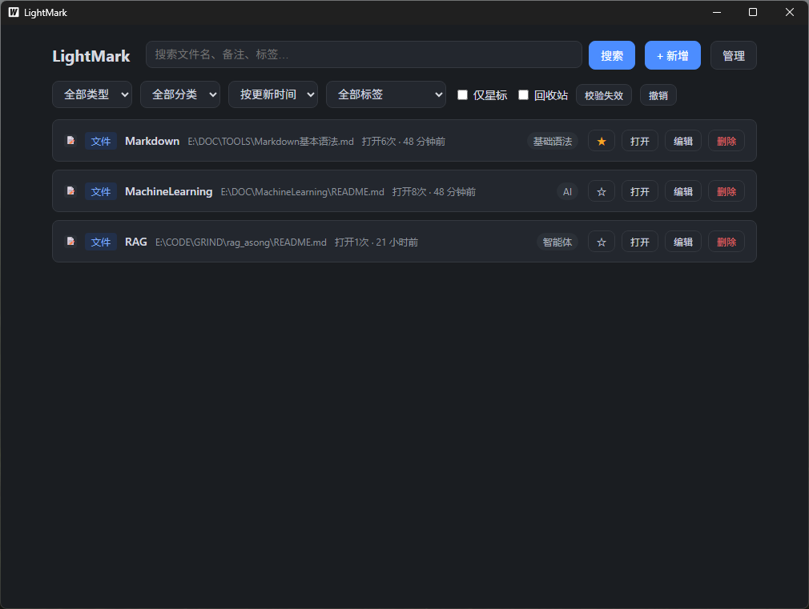
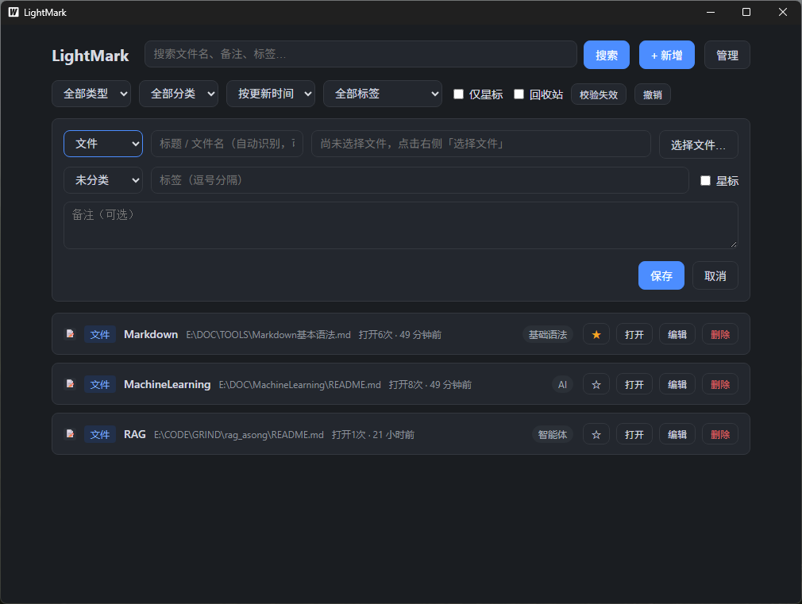
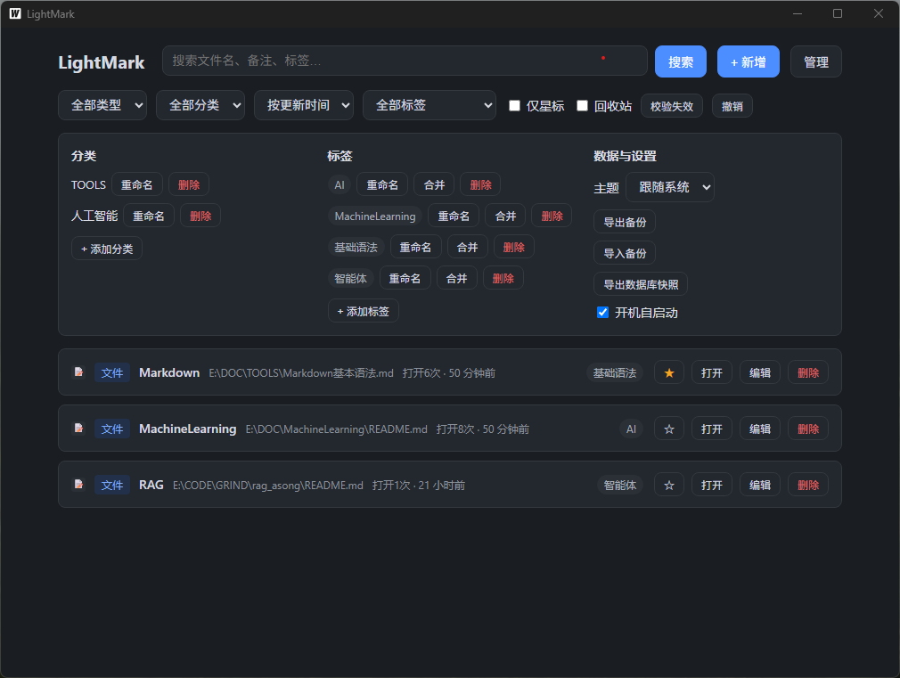

<p align="center">
  <picture>
    <source media="(prefers-color-scheme: dark)" srcset=".assets/logo-dark.svg" />
    
  </picture>
</p>

<p align="center">
  
</p>

**一座小而美的本地书签灯塔。** 把散落各处的**文件路径**与**网页地址**统一收进一个本地数据库，用全文搜索、标签、分类、星标与失效检测，让「我想找的」一眼就亮起来。

<div align="center">

<!-- 项目状态 -->
[](https://github.com/youngster-star/LightMark/releases/latest)
[](https://github.com/youngster-star/LightMark/releases/latest)
[](https://github.com/youngster-star/LightMark/stargazers)
[](./LICENSE)

<br />

<!-- 技术栈 -->
[](https://go.dev)
[](https://wails.io)
[](https://vuejs.org)
[](https://www.typescriptlang.org)
[](https://sqlite.org)

<br />

<!-- 平台与质量 -->
[](#安装)
[](#测试)

</div>

---

## 界面预览

**主界面** —— 全文搜索、多维筛选、星标与失效校验，一屏直达：

<p align="center">
  
</p>

<table>
  <tr>
    <td width="50%" align="center">
      <br />
      <b>新增与编辑</b>：文件选择 / 网页粘贴，标题自动识别
    </td>
    <td width="50%" align="center">
      <br />
      <b>管理面板</b>：分类标签、主题切换、备份与开机自启
    </td>
  </tr>
</table>

---

## 目录

- [界面预览](#界面预览)
- [安装](#安装)
- [功能特性](#功能特性)
- [技术栈](#技术栈)
- [项目结构](#项目结构)
- [使用说明](#使用说明)
- [数据与备份](#数据与备份)
- [测试](#测试)
- [打包发布](#打包发布)
- [开源协议](#开源协议)
- [开发者](#开发者)

---

## 安装

**方式一：下载安装（推荐普通用户）**

前往 [Releases](https://github.com/youngster-star/LightMark/releases/latest) 下载最新的 `light_mark.exe`，双击即可运行（Windows 10/11，一般已自带 WebView2 运行时）。应用常驻系统托盘，重复启动会自动唤起已运行的窗口，不会开启多个实例。

**方式二：从源码构建**

| 依赖 | 版本 | 说明 |
|---|---|---|
| Go | ≥ 1.25 | `go.mod` 锁定 1.25.0 |
| Node.js / npm | ≥ 20 | 仅构建前端用 |
| Wails CLI | v2.16.x | `go install github.com/wailsapp/wails/v2/cmd/wails@v2.16.0` |
| WebView2 运行时 | 自动检测 | Win10/11 一般已预装，缺失时 Wails 启动器会提示下载 |

```powershell
# 1. 克隆
git clone git@github.com:youngster-star/LightMark.git
cd LightMark

# 2. 构建（首次会自动 npm install + npm run build）
wails build

# 3. 运行
.\build\bin\light_mark.exe
```

开发模式（前端热重载 + Go 方法可在浏览器 devtools 调用）：

```powershell
wails dev
```

> Git 拉取后若 Go 方法有变更，`wails generate module` 会重新生成 `frontend/wailsjs/` 绑定（该目录不入库）。

---

## 功能特性

- **双形态收录**：文件路径（图片 / 文档 / 视频 / 压缩包等）与网页 URL 收入同一列表，双击即达
- **轻量去重**：录入时查重（大小写不敏感、URL 尾斜杠归一化），重复弹窗确认后仍可强制保存
- **全文搜索**：FTS5 全文索引，万条数据内常用查询均在 200ms 内返回；支持标题 / 备注 / 标签 / 元数据的组合过滤
- **标签体系**：自由打标、重命名（重名校验）、多标签合并且自动迁移关联与索引
- **分类管理**：创建 / 重命名 / 删除分类，与记录无强耦合
- **星标快捷置顶**：一键收藏、按星标筛选，星标变更不占用撤销栈
- **失效检测**：启动时后台自动校验 + 手动全量校验（8 并发），文件丢失或网页 404 即标记「失效」，编辑时可「重定位」
  - 网页状态码 404 → 不可用（403/401/429/5xx 视为可达）；URL 校验 HEAD 优先、405/501 自动回退 GET
- **回收站**：删除先入回收站可恢复；确认后可「彻底删除」，亦支持一键清空
- **撤销栈**：记录级新增 / 删除 / 恢复 / 编辑均可撤销最近一步
- **打开统计**：记录最近打开时间与累计打开次数，作为排序依据之一
- **自动备份**：每小时检查一次，距上次备份超过 24 小时自动写入 JSON 备份；支持手动导出 / 导入与 SQLite 整库快照
- **系统托盘**：最小化常驻托盘，托盘菜单退出，关闭窗口不丢进程
- **开机自启**：注册表方式可开关（Windows）
- **全局热键**：内置热键唤起主窗口（Windows）
- **单实例运行**：重复启动自动唤起已有窗口，绝不重复开多个进程
- **双主题**：跟随系统明暗主题切换
- **数据完全本地**：无账号、无云端、无遥测

---

## 技术栈

| 层 | 技术 |
|---|---|
| 框架 | Wails v2.16.0（Go ↔ WebView2 双向绑定） |
| 后端 | Go 1.25（唯一绑定点 `app.go` ~570 行：SaveRecord 拆分 + Read + Update + Delete 四合一） |
| 数据库 | SQLite（`modernc.org/sqlite` 纯 Go 驱动，免 CGO）+ FTS5 全文索引 |
| 前端 | Vue 3 `<script setup>` + TypeScript + Vite |
| 托盘 | `fyne.io/systray` |
| 通信 | Gorilla WebSocket（对外 API 桩，`/api/health` 健康检查 + WS 通道） |

> `third_party/go-webview2` 为本地补丁副本（`go.mod` 中 `replace` 指向），随仓库上传，勿删。

---

## 项目结构

```text
light_mark/
├── main.go                  # 程序入口（Wails 启动 + 单实例检测）
├── app.go                   # 唯一 Go 绑定层：全部前端可用方法
├── tray.go                  # 系统托盘
├── wails.json               # Wails 项目配置
├── go.mod / go.sum
├── LICENSE                  # MIT 开源协议
├── internal/
│   ├── model/               # 数据模型与输入校验类型
│   ├── store/               # SQLite 存储层（含 FTS、备份/快照、撤销快照）
│   ├── fileops/             # 文件探测、URL 可达性（HEAD→GET 回退）、MIME
│   ├── search/              # 查询构造
│   ├── api/                 # 本地 API 桩（health + WebSocket）
│   ├── hotkey/              # 全局热键
│   ├── autostart/           # 开机自启（Windows 注册表）
│   └── singleinstance/      # 单实例运行（命名互斥体 + 消息窗口）
├── frontend/                # Vue3 + TS 前端
│   ├── src/                 # 源码（App.vue 单页 + 样式）
│   └── package.json
├── .assets/                 # README 图文资源（LOGO、界面截图）
├── third_party/go-webview2/ # WebView2 本地补丁（replace）
├── PRD.md                   # 产品需求文档
└── DEVELOPMENT.md           # 开发笔记
```

---

## 使用说明

- **新增**：拖拽文件/文件夹到窗口即自动录入；「新增」按钮手动填写（文件 选路径 / 网页 贴 URL，可自动抓取标题与 favicon）
- **查找**：顶部搜索框全文检索；右侧按 类型 / 分类 / 标签 / 星标 过滤，支持按更新时间 / 标题 / 打开次数排序
- **编辑 / 重定位**：记录行「编辑」；失效记录打开编辑器即为重定位模式
- **星标**：列表内 ☆ 切换，右上角按星标筛选
- **撤销**：工具栏撤销最近一次记录操作（删除、恢复、编辑、新增）
- **回收站**：切换回收站视图后可「恢复 / 彻底删除」，或「清空回收站」
- **校验**：手动触发全量失效检测；列表内标红的「失效」徽章点击可重定位
- **托盘**：点 × 最小化到托盘；托盘菜单「退出」彻底关闭

---

## 数据与备份

| 文件 | 位置 | 说明 |
|---|---|---|
| 主数据库 | `%APPDATA%\light_mark\lightmark.db` | 全部记录/标签/分类，user_version=2 |
| 自动备份 | `%APPDATA%\light_mark\auto-时间戳.json` | 超过 24h 自动生成 |
| JSON 导出 | 用户指定路径 | 手动备份/迁移 |
| 快照 `.db` | 用户指定路径 | **SQLite 整库快照**（VACUUM INTO），可整库恢复 |

迁移到新机器：拷贝 `%APPDATA%\light_mark\` 整个目录，或在新机器「导入备份」。

---

## 测试

```powershell
go test ./...          # 52 项单元/集成/性能测试
go test ./internal/store -count=1 -v
```

> 万条数据性能基线：6 类典型查询全部 < 200ms（见 `internal/store/performance_test.go`）。

---

## 打包发布

```powershell
wails build            # 产出 build/bin/light_mark.exe（NSIS 安装包见 build/windows）
```

发布流程（维护者）：

```powershell
git tag v1.x.0
git push dkb master --tags
# 托管层：GitHub Releases 网页创建，附上 build/bin/light_mark.exe
```

---

## 开源协议

[](./LICENSE)

本项目基于 **[MIT License](./LICENSE)** 官方协议开源，基本含义**完全开源**：

- 任何人可**自由使用、复制、修改、合并、发布、分发、再授权与商用**，包括用于闭源商业产品
- 唯一义务：在软件的所有副本或主要部分中**保留原版权声明与本许可声明**
- 软件按「现状」提供，作者不对任何用途作出担保，亦不承担责任

完整协议文本见 [LICENSE](./LICENSE)。

---

## 开发者

| 角色 | ID | 邮箱 |
|---|---|---|
| 开发者 | dkb (youngster-star) | dkbzxxsd@163.com |
